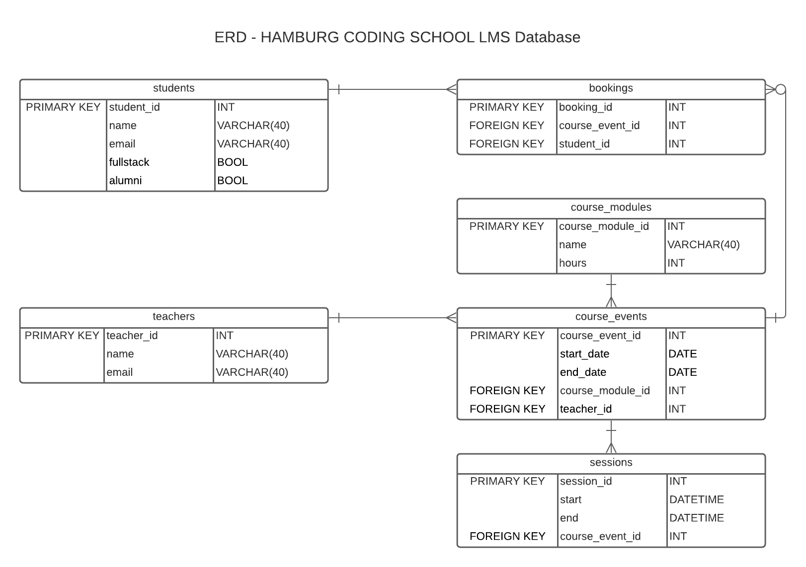

Hamburg Coding School - LMS



#### Creation
```sql
CREATE TABLE course_modules (
	course_module_id INT NOT NULL AUTO_INCREMENT,
	PRIMARY KEY (course_module_id),
	name VARCHAR(40),
	createdAt TIMESTAMP NOT NULL DEFAULT CURRENT_TIMESTAMP,
	updatedAt TIMESTAMP NOT NULL DEFAULT CURRENT_TIMESTAMP,
	hours INT(2)
);

CREATE TABLE teachers (
	teacher_id INT NOT NULL AUTO_INCREMENT,
	PRIMARY KEY (teacher_id),
	name VARCHAR(40),
	createdAt TIMESTAMP NOT NULL DEFAULT CURRENT_TIMESTAMP,
	updatedAt TIMESTAMP NOT NULL DEFAULT CURRENT_TIMESTAMP,
	email VARCHAR(40)
);	

CREATE TABLE course_events (
	course_event_id INT NOT NULL AUTO_INCREMENT,
	PRIMARY KEY (course_event_id),
	start_date DATE,
	course_end_date DATE,
	course_course_module_id INT,
	createdAt TIMESTAMP NOT NULL DEFAULT CURRENT_TIMESTAMP,
	updatedAt TIMESTAMP NOT NULL DEFAULT CURRENT_TIMESTAMP,
	FOREIGN KEY (course_module_id) REFERENCES course_modules (course_module_id) ON DELETE SET NULL,
	teacher_id INT,
	FOREIGN KEY (teacher_id) REFERENCES teachers (teacher_id) ON DELETE SET NULL
);

CREATE TABLE sessions (
	session_id INT NOT NULL AUTO_INCREMENT,
	PRIMARY KEY (session_id),
	session_start DATETIME,
	session_end DATETIME,
	course_event_id INT,
	createdAt TIMESTAMP NOT NULL DEFAULT CURRENT_TIMESTAMP,
	updatedAt TIMESTAMP NOT NULL DEFAULT CURRENT_TIMESTAMP,
	FOREIGN KEY (course_event_id) REFERENCES course_events (course_event_id) ON DELETE CASCADE
);
```


#### Inserting Data
```sql
-- insert data
INSERT INTO teachers (name, email) VALUES ('Teresa Holfeld', 'teresa@hamburgcodingschool.com');
INSERT INTO course_modules (name, hours) VALUES ('Workshop: Databases', '12');
INSERT INTO course_events (course_start_date, course_end_date, course_module_id, teacher_id) VALUES ('2021-04-13', '2021-05-11', '1', '7');
INSERT INTO sessions (session_start, session_end, course_event_id) VALUES ('2021-05-17T18:00', '2021-05-17T21:00', 11);
```


#### Queries
```sql
-- course with name, start and end date, teacher name
SELECT 
	teachers.name, 
	course_modules.name, 
	course_events.course_start_date, 
	course_events.course_end_date
FROM course_events
JOIN teachers
	ON course_events.teacher_id = teachers.teacher_id
JOIN course_modules
	ON course_events.course_module_id = course_modules.course_module_id;

-- course with name, start and end date, teacher name and all sessions
SELECT  
	course_modules.name, 
	teachers.name,
	course_events.course_start_date, 
	course_events.course_end_date,
	sessions.session_start, 
  sessions.session_end
FROM course_events
JOIN course_modules
	ON course_events.course_module_id = course_modules.course_module_id
JOIN teachers
	ON course_events.teacher_id = teachers.teacher_id
JOIN sessions
	ON course_events.course_event_id = sessions.course_event_id;
```